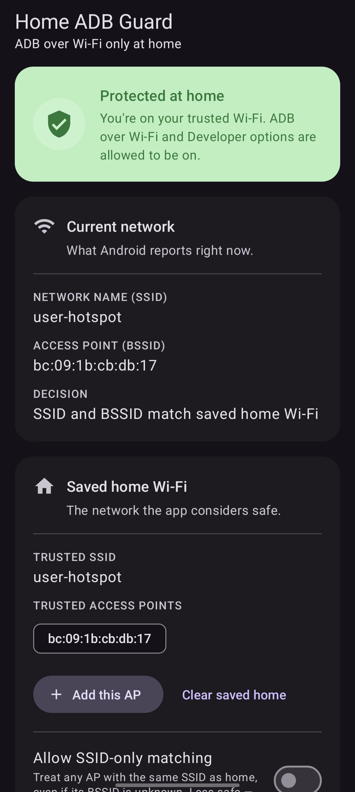
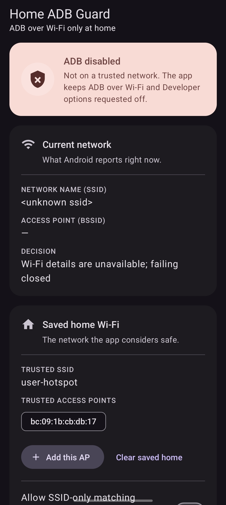

# Home ADB Guard

Minimal Android app that requests **Developer options** and **Wireless
debugging** to be enabled only when the phone is connected to a saved home
Wi-Fi network, and requests them disabled at any other time.

> **No warranty.** This is a hobbyist convenience tool. The author guarantees
> nothing about correctness, reliability, security, or compatibility with any
> specific device or Android version. Read [SECURITY.md](SECURITY.md) and
> [LICENSE](LICENSE) before installing.

---

## Screenshots

| At trusted home Wi-Fi | Off-network |
|---|---|
|  |  |

Left: monitoring is active on the saved home network — ADB over Wi-Fi and
Developer options are allowed to be on. Right: Wi-Fi identity is unavailable
or the network is not trusted — the app fails closed and requests both off.

---

## Status

- License: [MIT](LICENSE)
- Min SDK / Target SDK / Compile SDK: 36 (Android 16)
- Language: Java, Views + Material 3 (no Compose, no Kotlin)
- Build: Android Gradle Plugin 9.1.1, Gradle 9.4.x, JDK 17+
- UI: Material Design 3, light + dark, adaptive launcher icon, monochrome icon support

## What it does

- Watches the active Wi-Fi network via `ConnectivityManager.NetworkCallback`
  and a 30-second watchdog.
- When the current network matches the saved home SSID **and** a trusted home
  BSSID, sets `Settings.Global.adb_wifi_enabled = 1` and
  `Settings.Global.development_settings_enabled = 1`.
- In every other case (no Wi-Fi, wrong SSID, untrusted BSSID, missing
  permissions, Location off, Wi-Fi identity unreadable) it sets both back to
  `0`. The default behavior is to **fail closed**.
- Runs as a foreground service with a persistent notification while monitoring
  is active.
- Restarts monitoring after boot via `BOOT_COMPLETED` if monitoring was
  enabled when the device shut down.

## What it explicitly does not do

- No `INTERNET` permission. No cleartext traffic.
- No analytics, telemetry, crash reporting, or network client code.
- Only first-party Google/AndroidX libraries: AppCompat and Material
  Components for Android (Material Design 3). No analytics SDKs, no ad
  libraries, no crash reporters, no network clients.
- No accessibility service, no device admin / device owner, no root, no
  Shizuku.
- No location collection beyond what Android requires for Wi-Fi identity APIs.

The on-device persisted state is limited to:

- one home SSID,
- one or more trusted home BSSIDs,
- a monitoring on/off flag,
- a "SSID-only fallback" flag (default off),
- the most recent local status / write-result strings, for display only.

---

## Android constraints

### `WRITE_SECURE_SETTINGS` is required

A normal APK cannot write `Settings.Global` values. The app must be granted
`android.permission.WRITE_SECURE_SETTINGS` once via ADB after install (see
[Install](#install) below).

References:

- [`Settings.Global`](https://developer.android.com/reference/android/provider/Settings.Global)
- [Android permissions overview](https://developer.android.com/guide/topics/permissions/overview)

### Developer-options state cannot be read back reliably

`Settings.Global.DEVELOPMENT_SETTINGS_ENABLED` is documented to always read
back `0` for third-party apps. The app therefore treats its own write call as
a *request* and asks you to verify the actual state with ADB.

Reference:
[`DEVELOPMENT_SETTINGS_ENABLED`](https://developer.android.com/reference/kotlin/android/provider/Settings.Global#DEVELOPMENT_SETTINGS_ENABLED)

### Wireless debugging may need a one-time trust prompt

AOSP `adbd` ties Wireless debugging to the current Wi-Fi network and disables
it on network changes. Enable Wireless debugging once manually on your home
Wi-Fi and accept the trust prompt; the app can then toggle it on/off, but it
cannot pair a new computer for you.

References:

- [`WirelessDebuggingEnabler.java`](https://android.googlesource.com/platform/packages/apps/Settings/+/master/src/com/android/settings/development/WirelessDebuggingEnabler.java)
- [`AdbDebuggingManager.java`](https://android.googlesource.com/platform/frameworks/base/+/master/services/core/java/com/android/server/adb/AdbDebuggingManager.java)

### Wi-Fi SSID/BSSID needs runtime permissions and Location enabled

Modern Android treats Wi-Fi identity as privacy-sensitive. The app requests
Location and Nearby Wi-Fi Devices, and expects Location to be enabled. If
either is missing, the app fails closed and disables.

References:

- [`WifiInfo.getSSID()`](https://developer.android.com/reference/android/net/wifi/WifiInfo#getSSID())
- [Wi-Fi permissions](https://developer.android.com/develop/connectivity/wifi/wifi-permissions)

---

## Build

Requirements:

- Android SDK Platform 36 installed.
- JDK 17 or newer.
- The bundled Gradle wrapper (`./gradlew`) downloads its own Gradle
  distribution.

```sh
./gradlew assembleDebug
```

Output APK:

```
app/build/outputs/apk/debug/app-debug.apk
```

The wrapper expects the SDK location in `local.properties` (auto-generated by
Android Studio) or in the `ANDROID_HOME` environment variable. `local.properties`
is gitignored.

---

## Install

```sh
adb install -r app/build/outputs/apk/debug/app-debug.apk
```

Grant the protected permission:

```sh
adb shell pm grant app.homeadbguard android.permission.WRITE_SECURE_SETTINGS
```

Verify the grant:

```sh
adb shell dumpsys package app.homeadbguard | grep -A25 grantedPermissions
```

You should see `android.permission.WRITE_SECURE_SETTINGS` listed.

---

## First-time setup on the phone

1. Open **Home ADB Guard**.
2. Tap **Request runtime permissions** and allow:
   - Location
   - Nearby Wi-Fi devices
   - Notifications
3. Make sure system Location is enabled.
4. Connect to your home Wi-Fi.
5. If Developer options is hidden:
   *Settings → About phone → Software information → tap **Build number** 7 times.*
6. Open **Developer options** and enable **Wireless debugging** manually
   once. Accept the trust prompt for this Wi-Fi network.
7. In Home ADB Guard, tap **Save current Wi-Fi as home**.
8. Tap **Start monitoring**.

## Mesh Wi-Fi / multiple access points

The app saves one trusted BSSID when you tap **Save current Wi-Fi as home**.
For each additional AP you want to trust:

1. Walk near the AP and wait for the phone to roam.
2. Open the app and tap **Add current AP BSSID to trusted home list**.

## SSID-only fallback (off by default)

**Toggle SSID-only fallback** lets the app treat a matching SSID as home even
if the current BSSID is not in the trusted list. This is **less safe**: an
attacker can stand up a Wi-Fi network with the same SSID. Leave this off
unless your network legitimately rotates BSSIDs that you cannot enumerate.

---

## Verify behavior with ADB

```sh
adb shell settings get global development_settings_enabled
adb shell settings get global adb_wifi_enabled
```

Expected when on trusted home Wi-Fi with monitoring active:

```
1
1
```

Expected after leaving home Wi-Fi or tapping disable:

```
0
0
```

Confirm the app has no network permission:

```sh
adb shell dumpsys package app.homeadbguard | grep -E 'INTERNET|uses-permission|grantedPermissions' -A40
```

There should be no `android.permission.INTERNET` entry.

---

## Battery / OEM background restrictions

Foreground services are more reliable than plain receivers, but OEM policies
vary. If monitoring stops unexpectedly:

```
Settings → Apps → Home ADB Guard → Battery → Unrestricted
```

Avoid putting the app in any "deep sleep" / "hibernate apps" list.

References:

- [Android 14+ foreground service type requirement](https://developer.android.com/about/versions/14/changes/fgs-types-required)
- [Foreground service types](https://developer.android.com/develop/background-work/services/fgs/service-types)

## In-app actions

The Monitoring card has four buttons:

- **Enable ADB now** — refuses unless the current network matches your saved
  home Wi-Fi; on a match, writes `development_settings_enabled = 1` and
  toggles `adb_wifi_enabled` 0 → 1 to nudge AOSP `adbd` into re-binding.
  Useful when you tapped Disable on a trusted network and want ADB back
  without cycling Wi-Fi.
- **Re-check now** — re-evaluates the current network and applies the
  matching state. The 30-second watchdog already does this in the background.
- **Disable ADB now** — writes both settings to `0`. The app will re-enable
  on the next watchdog tick if monitoring is on and you are at home.
- **Stop and disable** — stops monitoring and writes both settings to `0`.

## Notification actions

While monitoring, the persistent notification exposes:

- **Apply now** — re-evaluate the current Wi-Fi and apply.
- **Disable now** — request Wireless debugging and Developer options off.
- **Stop** — stop monitoring and request both off.

## Failure modes

| Case | Behavior |
|---|---|
| Missing `WRITE_SECURE_SETTINGS` | Monitoring runs, settings writes fail. Grant via ADB. |
| Location permission denied | Wi-Fi identity unavailable; fails closed and disables. |
| Location toggle off | Wi-Fi identity unavailable; fails closed and disables. |
| SSID matches but BSSID is new | Disables, unless SSID-only fallback is enabled or you add the new BSSID. |
| Phone reboots | If monitoring was enabled, `BootReceiver` restarts the foreground service. |
| OEM blocks boot start | Open the app once and tap **Start monitoring**; set battery to Unrestricted. |
| Wireless debugging never trusted on this network | Android may disable or prompt. Enable/allow once manually in Developer options. |
| App is uninstalled | The app cannot run anymore. Manually disable Developer options / Wireless debugging if desired. |

---

## Source layout

```
app/src/main/AndroidManifest.xml
app/src/main/java/app/homeadbguard/MainActivity.java
app/src/main/java/app/homeadbguard/MonitorService.java
app/src/main/java/app/homeadbguard/ControlReceiver.java
app/src/main/java/app/homeadbguard/BootReceiver.java
app/src/main/java/app/homeadbguard/WifiState.java
app/src/main/java/app/homeadbguard/HomeMatcher.java
app/src/main/java/app/homeadbguard/SecureSettings.java
app/src/main/java/app/homeadbguard/Prefs.java
```

## Release signing

For a personal release build, create a keystore **outside this repository**
and do not commit it.

```sh
keytool -genkeypair \
  -alias home-adb-guard \
  -keyalg RSA \
  -keysize 4096 \
  -validity 10000 \
  -keystore ~/home-adb-guard-release.jks
```

Then configure signing through Android Studio or a local, gitignored Gradle
properties file. `*.jks`, `*.keystore`, and `keystore.properties` are already
in `.gitignore`.

## Uninstall cleanup

In the app, tap **Stop monitoring and disable now**. Or, from a host:

```sh
adb shell settings put global adb_wifi_enabled 0
adb shell settings put global development_settings_enabled 0
adb uninstall app.homeadbguard
```

---

## Contributing

Issues and pull requests are welcome. Please:

- Keep the dependency footprint at zero third-party Android libraries.
- Preserve the no-INTERNET, no-telemetry, fail-closed posture.
- Note any change that touches `WRITE_SECURE_SETTINGS` use in the PR
  description.

## License

[MIT](LICENSE) — provided **as is**, without warranty of any kind. See
[SECURITY.md](SECURITY.md) for the threat model and disclaimer.
